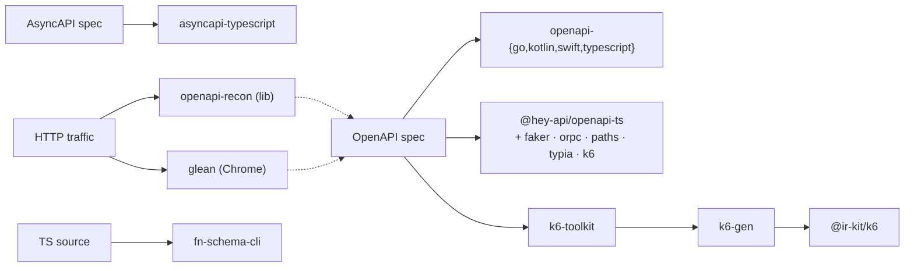

# ir-kit

[](https://pkg.pr.new)

A toolchain for everything you actually do with an OpenAPI / AsyncAPI spec besides shipping one TypeScript fetch client:

- **Native client SDKs** in Go, Kotlin, Swift, TypeScript — idiomatic per language, not transpiled from a TS base.
- **Spec-driven load testing** — typed [k6](https://k6.io) scripts with `defineLoadTest`/`flow().step()` chaining, no string-templating.
- **Spec discovery from traffic** — reverse-engineer an OpenAPI 3.1 spec from observed HTTP, either as a library or a Chrome extension.
- **Drop-in plugins for `@hey-api/openapi-ts`** — faker factories, oRPC clients, route maps, typia validators, and the k6 generator.

All targets share one normalization layer ([`@hey-api`](https://github.com/hey-api/openapi-ts)'s IR), so 2.0 / 3.0 / 3.1 inputs land in the same shape. Per-target generators (`@ir-kit/openapi-{go,kotlin,swift,typescript}`, `@ir-kit/k6-gen`) expose a pure `generate({ spec, output })` and don't require a hey-api plugin runner at the call site.

## Pick a tool

| You want to… | Reach for | Surface |
| --- | --- | --- |
| Generate a Go / Kotlin / Swift / TypeScript SDK | [`@ir-kit/openapi-<lang>`](#native-client-sdk-generators) | `generate({ spec, output })` or hey-api plugin |
| Load-test an OpenAPI API | [`@ir-kit/k6-toolkit`](./packages/k6/toolkit) on top of [`@ir-kit/k6`](./packages/k6/framework) | `sync()`, `runK6()`, `bundle()` |
| Reverse-engineer a spec from real traffic | [`@ir-kit/glean`](./apps/glean) (browser) or [`@ir-kit/openapi-recon`](./packages/openapi/recon) (lib) | DevTools extension / programmatic |
| Add faker mocks, oRPC clients, route maps, typia validators | hey-api [plugins](#hey-apiopenapi-ts-plugins) | `openapi-ts.config.ts` |
| Emit AsyncAPI 3.0 → TypeScript | [`@ir-kit/asyncapi-typescript`](./packages/asyncapi/typescript) | `generate({ spec, output })` |
| Extract JSON Schema from TS function signatures | [`@ir-kit/fn-schema-cli`](./packages/fn-schema/cli) | `fn-schema scan / extract / inspect` |

## Use with AI coding agents

ir-kit ships six Agent Skills that teach AI coding agents — Claude Code, Cursor, GitHub Copilot, Codex, Cline, Windsurf, and ~50 more — how to drive these packages without you re-explaining the API each session.

<details>
<summary><strong>Human</strong> — install from the terminal</summary>

```bash
# Install all skills (auto-detects your installed agents)
npx skills add ir-kit/ir-kit

# Pick specific skills
npx skills add ir-kit/ir-kit --skill k6-loadtest --skill openapi-sdk

# Install globally for every project
npx skills add ir-kit/ir-kit -g
```

</details>

<details>
<summary><strong>Agent</strong> — paste this into Claude Code, Cursor, Copilot, …</summary>

> Install the ir-kit Agent Skills from https://github.com/ir-kit/ir-kit into this project so you can use them in future sessions. Run `npx skills add ir-kit/ir-kit` — it auto-detects whichever agent I'm using and writes each `SKILL.md` to the right location. If that command isn't available, clone the repo and copy `skills/<name>/SKILL.md` into the skill directory for your agent (Claude Code: `.claude/skills/<name>/SKILL.md`). Then confirm these six are installed: `k6-loadtest`, `openapi-sdk`, `openapi-from-traffic`, `asyncapi-typescript`, `fn-schema`, `heyapi-plugin-author`.

</details>

<details>
<summary><strong>Skill triggers</strong> — what each one activates on</summary>

| Skill | Triggers on |
| --- | --- |
| `k6-loadtest` | "load test", "perf test", "k6", "stress test the API", "spike test", "soak test", "smoke test", "OpenAPI to k6", `defineLoadTest`, `runK6`, `useAuth`, "k6 scenarios", "k6 budgets" |
| `openapi-sdk` | "Go SDK", "Kotlin client", "Swift SDK", "generate client from OpenAPI", "SDK from spec", "OpenAPI to Go", "OpenAPI to Kotlin", "OpenAPI to Swift", "multi-language SDK" |
| `openapi-from-traffic` | "reverse engineer API", "OpenAPI from HAR", "discover spec from traffic", "capture API in DevTools", "infer schema from requests", "spec from observed HTTP", "generate spec from network tab" |
| `asyncapi-typescript` | "AsyncAPI", "event types from spec", "AMQP from spec", "RabbitMQ types", "message types", "pub/sub types", "publish/subscribe TypeScript", "event-driven typing" |
| `fn-schema` | "JSON Schema from TypeScript", "function signature to schema", "extract schema from TS function", "schemas from existing code", "schemas without rewriting types", "fn-schema", `schemaOf` |
| `heyapi-plugin-author` | "hey-api plugin", "openapi-ts plugin", "custom codegen plugin", "extend hey-api", "openapi-ts hooks", "openapi-ts plugin author", `definePluginConfig`, `definePlugin` |

</details>

This repo is also a **Claude Code plugin** — `.claude-plugin/plugin.json` + `marketplace.json` are committed at the root, so adding the repo as a marketplace in Claude Code surfaces all six skills automatically.

## How the pieces fit



Internal building blocks (`codegen-core`, `openapi-core`, `openapi-tools`, `asyncapi-core`) are listed under **Shared primitives** below — you usually consume one of the higher-level packages instead.

## Packages

<!-- @packages-start -->

### Native client SDK generators

| Package | Description |
| --- | --- |
| [`@ir-kit/openapi-go`](./packages/openapi/go) | Generate idiomatic Go (net/http + encoding/json + context.Context) client SDKs from an OpenAPI 3.x spec. |
| [`@ir-kit/openapi-kotlin`](./packages/openapi/kotlin) | Generate idiomatic Kotlin (OkHttp + kotlinx-serialization + suspend) client SDKs from an OpenAPI 3.x spec. |
| [`@ir-kit/openapi-swift`](./packages/openapi/swift) | Generate idiomatic Swift (Codable + URLSession + async throws) client SDKs from an OpenAPI 3.x spec. |
| [`@ir-kit/openapi-typescript`](./packages/openapi/typescript) | Thin programmatic wrapper around @hey-api/openapi-ts that ships a `generate()` matching the shape of @ir-kit/openapi-{go,kotlin,swift}, so the same sdk-regen workflow can target TypeScript clients (types + sdk + schemas + transformers + validators + ...) via hey-api's plugin pipeline. |

### Load testing (k6)

| Package | Description |
| --- | --- |
| [`@ir-kit/create-k6`](./packages/k6/create) | Wizard scaffolder for the @ir-kit/k6 stack. Run `npm create @ir-kit/k6` to generate a typed client from your OpenAPI spec and a starter loadtest.ts in one shot. |
| [`@ir-kit/k6`](./packages/k6/framework) | Framework for authoring k6 load tests in TypeScript: defineLoadTest, flow().step() chaining, pace presets, budgets, auth middleware. Compiles to standard k6. |
| [`@ir-kit/k6-gen`](./packages/k6/codegen) | Programmatic generator: OpenAPI spec → typed k6 client (one function per operation), TS types, and faker-backed data builders. No hey-api plugin required. |
| [`@ir-kit/k6-toolkit`](./packages/k6/toolkit) | Programmatic toolkit for k6 workflows. Bundle loadtests (tsdown passthrough), spawn the k6 binary, sync the typed client from OpenAPI specs. One library covering the bundle → run → sync flow. |

### Spec → AsyncAPI targets

| Package | Description |
| --- | --- |
| [`@ir-kit/asyncapi-typescript`](./packages/asyncapi/typescript) | AsyncAPI 3.0 → TypeScript generator. Plugin-compose architecture: a small core orchestrates parser → IR → registered plugins, each emitting one slice of generated code (types, Events const, dispatch helpers, AMQP helpers, framework adapters). Parser via @asyncapi/parser, JSON Schema → TS via @asyncapi/modelina, file orchestration via @hey-api/codegen-core. |

### `@hey-api/openapi-ts` plugins

| Package | Description |
| --- | --- |
| [`@ir-kit/openapi-ts-faker`](./packages/openapi/plugins/faker) | Faker.js plugin for @hey-api/openapi-ts - Generate realistic mock data factories from OpenAPI specs |
| [`@ir-kit/openapi-ts-k6`](./packages/k6/hey-api) | Thin @hey-api/openapi-ts plugin that delegates to @ir-kit/k6-gen. Use if you already drive codegen through openapi-ts.config.ts; otherwise reach for @ir-kit/k6-toolkit. |
| [`@ir-kit/openapi-ts-orpc`](./packages/openapi/plugins/orpc) | oRPC plugin for @hey-api/openapi-ts - Generate type-safe RPC clients and servers from OpenAPI specs |
| [`@ir-kit/openapi-ts-paths`](./packages/openapi/plugins/paths) | Plugin for @hey-api/openapi-ts — emit per-operation route consts (spec template, URLPattern, method, operationId) for tree-shakable runtime routing and matching |
| [`@ir-kit/openapi-ts-typia`](./packages/openapi/plugins/typia) | Typia plugin for @hey-api/openapi-ts — generate compile-time Standard Schema validators from OpenAPI specs |

### Spec discovery from traffic

| Package | Description |
| --- | --- |
| [`@ir-kit/glean`](./apps/glean) | Glean — reverse-engineer OpenAPI 3.1 specs from traffic observed in your DevTools. |
| [`@ir-kit/openapi-recon`](./packages/openapi/recon) | Reverse-engineer an OpenAPI 3.1 spec from observed HTTP traffic — runtime-agnostic, accepts standard Request/Response, works in browsers, Node, edge runtimes |

### TypeScript function schemas

| Package | Description |
| --- | --- |
| [`@ir-kit/fn-schema-cli`](./packages/fn-schema/cli) | CLI wrapper for fn-schema. Thin orchestrator over @ir-kit/fn-schema-core with the TypeScript extractor pre-registered. Loads optional fn-schema.config.{ts,js,json} via c12. |
| [`@ir-kit/fn-schema-core`](./packages/fn-schema/core) | Language-agnostic core for fn-schema: extract function input/output JSON Schemas from source code. Defines the Extractor contract and ships emitters (files, bundle, OpenAPI) that operate on the shared FunctionInfo IR. |
| [`@ir-kit/fn-schema-loader`](./packages/fn-schema/loader) | Type-safe reader for fn-schema bundles. Resolves $ref pointers, indexes signatures by id and named types by identity keyword. Zero runtime dependencies — works in any JS runtime that can read JSON. |
| [`@ir-kit/fn-schema-transformer`](./packages/fn-schema/transformer) | TypeScript compiler-API transformer that inlines fn-schema results into emitted code. Replaces `schemaOf(myFunction)` calls with the literal JSON Schema at build time, eliminating runtime extraction cost. Plug into ts-patch, swc, esbuild, or any tool that accepts a custom TS transformer. |
| [`@ir-kit/fn-schema-typescript`](./packages/fn-schema/typescript) | TypeScript extractor for fn-schema. Walks source via ts-morph, synthesizes virtual type aliases for each function's parameters and return, then converts them to JSON Schema via ts-json-schema-generator. Re-exports a pre-wired `extract` for single-language use. |
| [`@ir-kit/fn-schema-unplugin`](./packages/fn-schema/unplugin) | Bundler plugin for fn-schema. Exposes a virtual module that resolves to the extracted bundle, with HMR on source change in dev. Built on unplugin so the same package powers Vite, webpack, Rollup, esbuild, Rspack, Rolldown, and Farm. |

### Shared primitives

| Package | Description |
| --- | --- |
| [`@ir-kit/asyncapi-core`](./packages/asyncapi/core) | Shared AsyncAPI 3.0 primitives for codegen — uniform parseSpec entry point on top of @asyncapi/parser, plus AMQP binding extractors and routing-key matching. Mirror of @ir-kit/openapi for the AsyncAPI track. |
| [`@ir-kit/codegen-core`](./packages/shared/codegen-core) | Spec-agnostic codegen primitives shared by OpenAPI and AsyncAPI generator families — identifier transforms (pascal/camel/safeIdent), filesystem safety, project-name derivation. Pure functions, no spec dependencies. |
| [`@ir-kit/openapi`](./packages/openapi/ir) | Language-agnostic OpenAPI IR-walking primitives shared by the native-SDK generators. Each helper consumes @hey-api/shared's IR and returns target-neutral data — parameter locations, response categories, body media-type classifications — so per-language emitters can stay focused on rendering. |
| [`@ir-kit/openapi-tools`](./packages/openapi/tools) | OpenAPI utilities — request matching, spec diffing, parsing. Tree-shakable, pure functions, works on frontend or backend |

### Other

| Package | Description |
| --- | --- |
| [`@ir-kit/asyncapi-loader`](./packages/asyncapi/loader) | Load and validate an AsyncAPI 3.x document from a file path, URL, string, or pre-parsed `AsyncAPIDocumentInterface`. Wraps `@ir-kit/asyncapi-core`'s `parseSpec` for unified input dispatch. |
| [`@ir-kit/cli`](./packages/cli) | Unified `ir` CLI — single entry point for spec loading, conversion, codegen, and reverse-engineering across every supported API standard. Commands are JSON-Schema-defined; runtime auto-derives flags, prompts, help, and validation from the schema. |
| [`@ir-kit/openapi-loader`](./packages/openapi/loader) | Load an OpenAPI 3.x spec from a file path, URL, or pre-parsed object. Bundles `$ref`s via `@hey-api/json-schema-ref-parser` and runs optional hey-api-aware normalization. |
| [`@ir-kit/schema`](./packages/shared/schema) | Canonical JSON Schema 2020-12 IR shared across OpenAPI and AsyncAPI codegen families. Source-agnostic schema model + adapters from hey-api's IR.SchemaObject and @asyncapi/parser schemas. |
| [`@ir-kit/spec-convert`](./packages/shared/spec-convert) | Convert between API specification formats — OpenAPI 3, AsyncAPI 3, TypeSpec, Protobuf, JSON Schema. Pair-handler registry; programmatic API; thin wrappers around upstream conversion tools where available. |
| [`@ir-kit/spec-loader`](./packages/shared/spec-loader) | Universal spec loader for OpenAPI, AsyncAPI, and TypeSpec. Detects format by extension + content sniff and dispatches to the per-format loader, returning a discriminated `{ kind, document }` result. |
| [`@ir-kit/typespec-loader`](./packages/openapi/typespec-loader) | Compile a TypeSpec file to an OpenAPI 3.x document in memory. Thin wrapper over @typespec/compiler + @typespec/openapi3 — plugs into any @ir-kit OpenAPI generator at the spec-loading boundary. |

<!-- @packages-end -->

> The package list above is auto-generated from each `package.json`'s `description` field, with categories driven by [`scripts/sync-readme.mjs`](./scripts/sync-readme.mjs). The lefthook pre-commit hook keeps it current; run `pnpm sync:readme` manually if needed.

Three `@hey-api/openapi-ts` plugins ship in lockstep via Changesets' `fixed` config (`openapi-ts-faker`, `openapi-ts-orpc`, `openapi-ts-typia`) — bumping one bumps all three. `openapi-ts-paths` and `openapi-ts-k6` version independently, as does everything else.

## Examples

| Example | Shows |
| --- | --- |
| [`petstore-sdk`](./examples/petstore-sdk) | Generate Go / Kotlin / Swift / TypeScript SDKs from the petstore spec. Each language has a buildable consumer app under `<lang>/example/` exercising CRUD, auth, multipart, per-call options, response headers, validators, transformers. |
| [`k6-petstore`](./examples/k6-petstore) | End-to-end k6 track: `pnpm sync` (driving `@ir-kit/k6-toolkit`'s `sync()`) generates a typed client from `petstore.yaml`, then `loadtest.ts` composes 4 scenarios (browse / write / stress / spike) with flat budgets, per-op overrides, step chaining, and `data.<Type>()` faker payloads. `pnpm run:smoke` runs against the public petstore demo. |
| [`orpc-basic`](./examples/orpc-basic) | Minimal `@ir-kit/openapi-ts-orpc` setup — wire the plugin into `openapi-ts.config.ts` and consume the generated oRPC clients/servers. |
| [`asyncapi-events-playground`](./examples/asyncapi-events-playground) | `@ir-kit/asyncapi-typescript` against an AsyncAPI 3.0 spec — emits typed event constants, dispatch helpers, AMQP bindings, framework adapters. |
| [`fn-schema-basic`](./examples/fn-schema-basic) | `fn-schema-cli` extracts JSON Schemas for function inputs/outputs from TypeScript source; emit as files, bundle, or OpenAPI fragments. |

## Contributing

```bash
pnpm install
pnpm build
pnpm typecheck
pnpm test
```

Releases run on [Changesets](https://github.com/changesets/changesets):

```bash
pnpm changeset           # describe a change
pnpm version-packages    # bump versions + write CHANGELOGs (locally)
pnpm release             # build + publish via changeset publish
```

In CI, pushing a `.changeset/*.md` to `main` opens a "Version Packages" PR; merging that PR publishes to npm.

Every PR also triggers a [pkg.pr.new](https://pkg.pr.new) preview build — install any package at the PR's commit SHA without waiting for a release:

```bash
pnpm add https://pkg.pr.new/@ir-kit/openapi-tools@<commit-sha>
```
