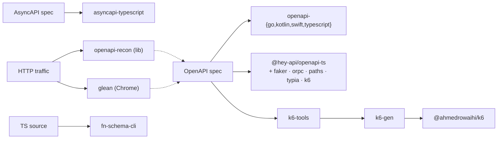

# contract-kit

[](https://pkg.pr.new)

A toolchain for everything you actually do with an OpenAPI / AsyncAPI spec besides shipping one TypeScript fetch client:

- **Native client SDKs** in Go, Kotlin, Swift, TypeScript — idiomatic per language, not transpiled from a TS base.
- **Spec-driven load testing** — typed [k6](https://k6.io) scripts with `defineLoadTest`/`flow().step()` chaining, no string-templating.
- **Spec discovery from traffic** — reverse-engineer an OpenAPI 3.1 spec from observed HTTP, either as a library or a Chrome extension.
- **Drop-in plugins for `@hey-api/openapi-ts`** — faker factories, oRPC clients, route maps, typia validators, and the k6 generator.

All targets share one normalization layer ([`@hey-api`](https://github.com/hey-api/openapi-ts)'s IR), so 2.0 / 3.0 / 3.1 inputs land in the same shape. Per-target generators (`@ahmedrowaihi/openapi-{go,kotlin,swift,typescript}`, `@ahmedrowaihi/k6-gen`) expose a pure `generate({ spec, output })` and don't require a hey-api plugin runner at the call site — the CLI wrappers (`k6-tools`, etc.) work standalone.

## Pick a tool

| You want to… | Reach for | Surface |
| --- | --- | --- |
| Generate a Go / Kotlin / Swift / TypeScript SDK | [`@ahmedrowaihi/openapi-<lang>`](#native-client-sdk-generators) | `generate({ spec, output })` or hey-api plugin |
| Load-test an OpenAPI API | [`@ahmedrowaihi/k6-tools`](./packages/k6/tools) on top of [`@ahmedrowaihi/k6`](./packages/k6/framework) | `k6-tools init / sync / run` |
| Reverse-engineer a spec from real traffic | [`@ahmedrowaihi/glean`](./apps/glean) (browser) or [`@ahmedrowaihi/openapi-recon`](./packages/openapi/recon) (lib) | DevTools extension / programmatic |
| Add faker mocks, oRPC clients, route maps, typia validators | hey-api [plugins](#hey-apiopenapi-ts-plugins) | `openapi-ts.config.ts` |
| Emit AsyncAPI 3.0 → TypeScript | [`@ahmedrowaihi/asyncapi-typescript`](./packages/asyncapi/typescript) | `generate({ spec, output })` |
| Extract JSON Schema from TS function signatures | [`@ahmedrowaihi/fn-schema-cli`](./packages/fn-schema/cli) | `fn-schema scan / extract / inspect` |

## How the pieces fit



Internal building blocks (`codegen-core`, `openapi-core`, `openapi-tools`, `asyncapi-core`) are listed under **Shared primitives** below — you usually consume one of the higher-level packages instead.

## Packages

<!-- @packages-start -->

### Native client SDK generators

| Package | Description |
| --- | --- |
| [`@ahmedrowaihi/openapi-go`](./packages/openapi/go) | Generate idiomatic Go (net/http + encoding/json + context.Context) client SDKs from an OpenAPI 3.x spec. |
| [`@ahmedrowaihi/openapi-kotlin`](./packages/openapi/kotlin) | Generate idiomatic Kotlin (OkHttp + kotlinx-serialization + suspend) client SDKs from an OpenAPI 3.x spec. |
| [`@ahmedrowaihi/openapi-swift`](./packages/openapi/swift) | Generate idiomatic Swift (Codable + URLSession + async throws) client SDKs from an OpenAPI 3.x spec. |
| [`@ahmedrowaihi/openapi-typescript`](./packages/openapi/typescript) | Thin programmatic wrapper around @hey-api/openapi-ts that ships a `generate()` matching the shape of @ahmedrowaihi/openapi-{go,kotlin,swift}, so the same sdk-regen workflow can target TypeScript clients (types + sdk + schemas + transformers + validators + ...) via hey-api's plugin pipeline. |

### Spec → other targets

| Package | Description |
| --- | --- |
| [`@ahmedrowaihi/asyncapi-typescript`](./packages/asyncapi/typescript) | AsyncAPI 3.0 → TypeScript generator. Plugin-compose architecture: a small core orchestrates parser → IR → registered plugins, each emitting one slice of generated code (types, Events const, dispatch helpers, AMQP helpers, framework adapters). Parser via @asyncapi/parser, JSON Schema → TS via @asyncapi/modelina, file orchestration via @hey-api/codegen-core. |
| [`@ahmedrowaihi/k6`](./packages/k6/framework) | Framework for authoring k6 load tests in TypeScript: defineLoadTest, flow().step() chaining, pace presets, budgets, auth middleware. Compiles to standard k6. |
| [`@ahmedrowaihi/k6-gen`](./packages/k6/gen) | Programmatic generator: OpenAPI spec → typed k6 client (one function per operation), TS types, and faker-backed data builders. No hey-api plugin required. |
| [`@ahmedrowaihi/k6-tools`](./packages/k6/tools) | CLI for the @ahmedrowaihi/k6 framework. Scaffold load tests (init), regenerate the typed client (sync), bundle+run scripts against the real k6 binary, replay recorded traffic. |

### `@hey-api/openapi-ts` plugins

| Package | Description |
| --- | --- |
| [`@ahmedrowaihi/openapi-ts-faker`](./packages/openapi/plugins/faker) | Faker.js plugin for @hey-api/openapi-ts - Generate realistic mock data factories from OpenAPI specs |
| [`@ahmedrowaihi/openapi-ts-k6`](./packages/k6/hey-api) | Thin @hey-api/openapi-ts plugin that delegates to @ahmedrowaihi/k6-gen. Use if you already drive codegen through openapi-ts.config.ts; otherwise prefer the k6-tools CLI. |
| [`@ahmedrowaihi/openapi-ts-orpc`](./packages/openapi/plugins/orpc) | oRPC plugin for @hey-api/openapi-ts - Generate type-safe RPC clients and servers from OpenAPI specs |
| [`@ahmedrowaihi/openapi-ts-paths`](./packages/openapi/plugins/paths) | Plugin for @hey-api/openapi-ts — emit per-operation route consts (spec template, URLPattern, method, operationId) for tree-shakable runtime routing and matching |
| [`@ahmedrowaihi/openapi-ts-typia`](./packages/openapi/plugins/typia) | Typia plugin for @hey-api/openapi-ts — generate compile-time Standard Schema validators from OpenAPI specs |

### Spec discovery from traffic

| Package | Description |
| --- | --- |
| [`@ahmedrowaihi/glean`](./apps/glean) | Glean — reverse-engineer OpenAPI 3.1 specs from traffic observed in your DevTools. |
| [`@ahmedrowaihi/openapi-recon`](./packages/openapi/recon) | Reverse-engineer an OpenAPI 3.1 spec from observed HTTP traffic — runtime-agnostic, accepts standard Request/Response, works in browsers, Node, edge runtimes |

### TypeScript function schemas

| Package | Description |
| --- | --- |
| [`@ahmedrowaihi/fn-schema-cli`](./packages/fn-schema/cli) | CLI wrapper for fn-schema. Thin orchestrator over @ahmedrowaihi/fn-schema-core with the TypeScript extractor pre-registered. Loads optional fn-schema.config.{ts,js,json} via c12. |
| [`@ahmedrowaihi/fn-schema-core`](./packages/fn-schema/core) | Language-agnostic core for fn-schema: extract function input/output JSON Schemas from source code. Defines the Extractor contract and ships emitters (files, bundle, OpenAPI) that operate on the shared FunctionInfo IR. |
| [`@ahmedrowaihi/fn-schema-loader`](./packages/fn-schema/loader) | Type-safe reader for fn-schema bundles. Resolves $ref pointers, indexes signatures by id and named types by identity keyword. Zero runtime dependencies — works in any JS runtime that can read JSON. |
| [`@ahmedrowaihi/fn-schema-transformer`](./packages/fn-schema/transformer) | TypeScript compiler-API transformer that inlines fn-schema results into emitted code. Replaces `schemaOf(myFunction)` calls with the literal JSON Schema at build time, eliminating runtime extraction cost. Plug into ts-patch, swc, esbuild, or any tool that accepts a custom TS transformer. |
| [`@ahmedrowaihi/fn-schema-typescript`](./packages/fn-schema/typescript) | TypeScript extractor for fn-schema. Walks source via ts-morph, synthesizes virtual type aliases for each function's parameters and return, then converts them to JSON Schema via ts-json-schema-generator. Re-exports a pre-wired `extract` for single-language use. |
| [`@ahmedrowaihi/fn-schema-unplugin`](./packages/fn-schema/unplugin) | Bundler plugin for fn-schema. Exposes a virtual module that resolves to the extracted bundle, with HMR on source change in dev. Built on unplugin so the same package powers Vite, webpack, Rollup, esbuild, Rspack, Rolldown, and Farm. |

### Shared primitives

| Package | Description |
| --- | --- |
| [`@ahmedrowaihi/asyncapi-core`](./packages/asyncapi/core) | Shared AsyncAPI 3.0 primitives for codegen — uniform parseSpec entry point on top of @asyncapi/parser, plus AMQP binding extractors and routing-key matching. Mirror of @ahmedrowaihi/openapi-core for the AsyncAPI track. |
| [`@ahmedrowaihi/codegen-core`](./packages/shared/codegen-core) | Spec-agnostic codegen primitives shared by OpenAPI and AsyncAPI generator families — identifier transforms (pascal/camel/safeIdent), filesystem safety, project-name derivation. Pure functions, no spec dependencies. |
| [`@ahmedrowaihi/openapi-core`](./packages/openapi/core) | Shared building blocks for native-client SDK generators on top of OpenAPI 3.x — identifier transforms, security-scheme walkers, ref helpers, filesystem safety. Used by @ahmedrowaihi/openapi-go, @ahmedrowaihi/openapi-kotlin, @ahmedrowaihi/openapi-swift. |
| [`@ahmedrowaihi/openapi-tools`](./packages/openapi/tools) | OpenAPI utilities — request matching, spec diffing, parsing. Tree-shakable, pure functions, works on frontend or backend |

<!-- @packages-end -->

> The package list above is auto-generated from each `package.json`'s `description` field, with categories driven by [`scripts/sync-readme.mjs`](./scripts/sync-readme.mjs). The lefthook pre-commit hook keeps it current; run `pnpm sync:readme` manually if needed.

Three `@hey-api/openapi-ts` plugins ship in lockstep via Changesets' `fixed` config (`openapi-ts-faker`, `openapi-ts-orpc`, `openapi-ts-typia`) — bumping one bumps all three. `openapi-ts-paths` and `openapi-ts-k6` version independently, as does everything else.

## Examples

| Example | Shows |
| --- | --- |
| [`petstore-sdk`](./examples/petstore-sdk) | Generate Go / Kotlin / Swift / TypeScript SDKs from the petstore spec. Each language has a buildable consumer app under `<lang>/example/` exercising CRUD, auth, multipart, per-call options, response headers, validators, transformers. |
| [`k6-petstore`](./examples/k6-petstore) | End-to-end k6 track: `k6-tools sync` generates a typed client from `petstore.yaml`, then `loadtest.ts` composes 4 scenarios (browse / write / stress / spike) with flat budgets, per-op overrides, step chaining, and `data.<Type>()` faker payloads. `pnpm run:smoke` runs against the public petstore demo. |
| [`orpc-basic`](./examples/orpc-basic) | Minimal `@ahmedrowaihi/openapi-ts-orpc` setup — wire the plugin into `openapi-ts.config.ts` and consume the generated oRPC clients/servers. |
| [`asyncapi-events-playground`](./examples/asyncapi-events-playground) | `@ahmedrowaihi/asyncapi-typescript` against an AsyncAPI 3.0 spec — emits typed event constants, dispatch helpers, AMQP bindings, framework adapters. |
| [`fn-schema-basic`](./examples/fn-schema-basic) | `fn-schema-cli` extracts JSON Schemas for function inputs/outputs from TypeScript source; emit as files, bundle, or OpenAPI fragments. |

## Contributing

```bash
pnpm install
pnpm build
pnpm typecheck
pnpm test
```

Releases run on [Changesets](https://github.com/changesets/changesets):

```bash
pnpm changeset           # describe a change
pnpm version-packages    # bump versions + write CHANGELOGs (locally)
pnpm release             # build + publish via changeset publish
```

In CI, pushing a `.changeset/*.md` to `main` opens a "Version Packages" PR; merging that PR publishes to npm.

Every PR also triggers a [pkg.pr.new](https://pkg.pr.new) preview build — install any package at the PR's commit SHA without waiting for a release:

```bash
pnpm add https://pkg.pr.new/@ahmedrowaihi/openapi-tools@<commit-sha>
```
